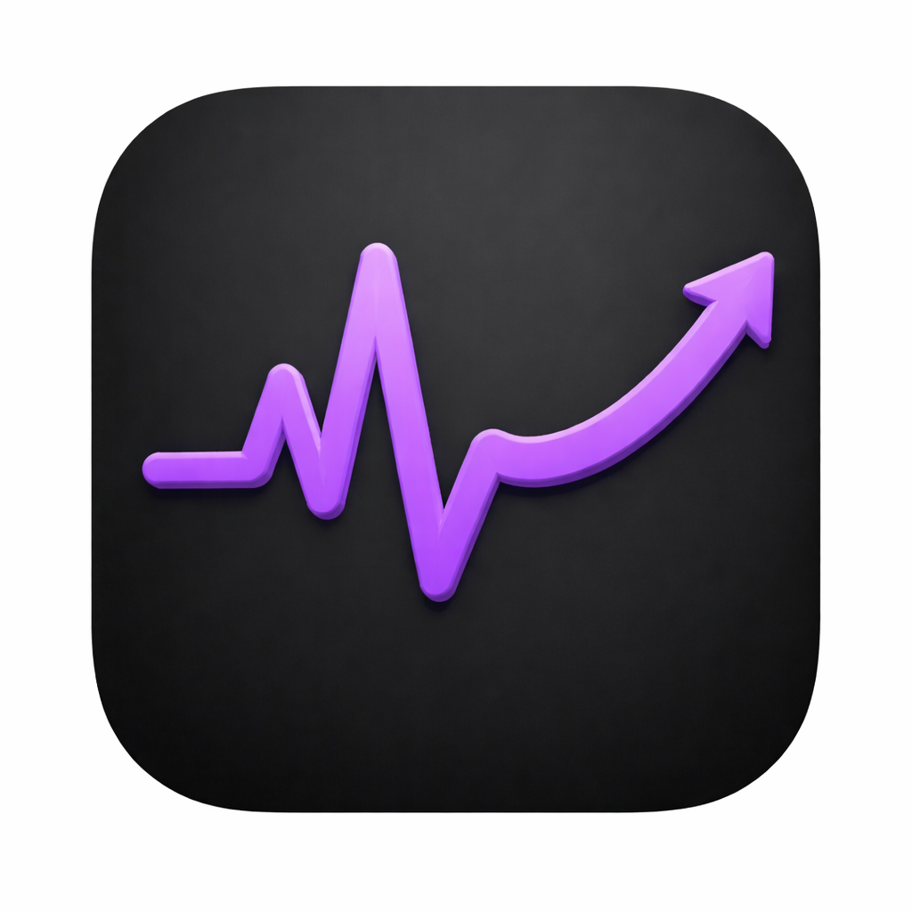

<div align="center">
  
  <h1>Pulse</h1>
</div>

<p align="center">
  <strong>Google Search Console insights, powered by Claude.</strong>
</p>

<p align="center">
  
  
  
  
  
</p>

Load a Google Search Console CSV export, explore clicks and impressions over time, filter by date range, and generate AI-powered insights with a single click.

## Features

- One-time CSV ingestion into SQLite via streaming (431K rows, never fully in memory)
- Interactive trend chart — clicks and impressions over a custom date range
- Date range picker with Apply button for instant chart updates
- Generate Insights button — sends a compact SQL-aggregated payload to Claude, returns structured analysis
- Zod-validated Claude responses with graceful fallback on unexpected output

## Setup

**Requirements:** Node.js 20+, the `arckeywords.csv` data file

**1. Clone and install**

```bash
git clone https://github.com/thebrownproject/pulse
cd pulse
npm install
```

**2. Add environment variables**

```bash
cp .env.example .env
```

Edit `.env` and set your Anthropic API key:

```
ANTHROPIC_API_KEY=your_key_here
```

**3. Place the data file**

Copy `arckeywords.csv` into the `data/` directory:

```
data/arckeywords.csv
```

**4. Run the dev server**

```bash
npm run dev
```

Open [http://localhost:3000](http://localhost:3000).

**5. Ingest the CSV**

On first run, visit this URL once to load the data into SQLite:

```
http://localhost:3000/api/ingest
```

Ingestion takes 10-20 seconds for 431K rows. After that, all queries are instant.

**6. Use the app**

- Select a date range and click **Apply** to update the chart
- Click **Generate Insights** to run Claude analysis on the filtered data

## Architecture

### The 200MB problem

The brief asks you to "handle the large dataset intelligently." The approach here:

1. **Ingest once, query forever.** The CSV is streamed row-by-row via `csv-parse` and inserted into SQLite in batches of 1000 rows per transaction. The file never sits fully in memory. After ingestion, the CSV is no longer needed.

2. **SQL does the heavy lifting.** Date range filtering, aggregation, and top-N queries are indexed SQL operations — not in-memory sorts over 431K rows. Chart data returns in under 50ms.

3. **Claude gets a 2-5KB summary, not raw data.** Before calling Claude, the API route builds a compact payload from SQL: summary stats, max 30 daily trend points (downsampled for wide ranges), top 10 keywords, top 10 pages. This is feature engineering, not prompt stuffing.

### Data flow

```
[One-time setup]
arckeywords.csv (77MB, 431K rows)
  → stream row-by-row (csv-parse)
  → batch INSERT 1000 rows/tx
  → SQLite (data/gsc.db) + date index

[Chart]
GET /api/metrics?start=&end=
  → SELECT date, SUM(clicks), SUM(impressions) GROUP BY date
  → Recharts LineChart

[Insights]
POST /api/insights { startDate, endDate }
  → SQL: summary stats + top keywords + top pages + daily trend
  → compact JSON payload (~2-5KB)
  → Claude API
  → Zod validation
  → structured insights panel
```

### Key decisions

**SQLite over client-side streaming**
Both the chart and Claude insights need fast filtered queries. SQLite gives one data store, one query language, and indexed reads. A streaming approach would re-scan the CSV on every date range change.

**csv-parse over PapaParse**
Node-native streaming, no browser dependency. More reliable server-side for a 431K row ingestion job.

**Zod validation on Claude responses**
Claude returns JSON but the structure can vary. Zod validates the schema before rendering — if it fails, the raw response is displayed with a warning rather than crashing the UI.

**Ingestion as API route**
Avoids ts-node setup for a standalone script. One GET request triggers the full pipeline.

### What I'd improve with more time

- Streaming Claude responses via AI SDK `streamText` for progressive rendering
- Background ingestion with a progress bar (Server-Sent Events)
- Compound index on `(analytics_date, keyword)` for faster keyword breakdowns
- Deployed version with the CSV pre-loaded

## Tech Stack

| Layer | Choice |
|-------|--------|
| Framework | Next.js 16 (App Router) + TypeScript |
| Database | better-sqlite3 |
| Chart | Recharts (via shadcn/ui) |
| CSV parsing | csv-parse |
| AI | @anthropic-ai/sdk |
| Validation | Zod |
| Styling | Tailwind CSS v4 |
| Date handling | date-fns |
